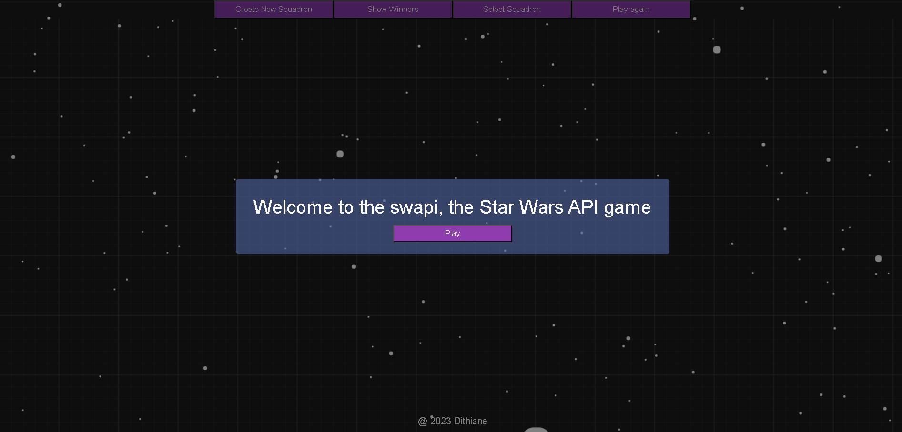
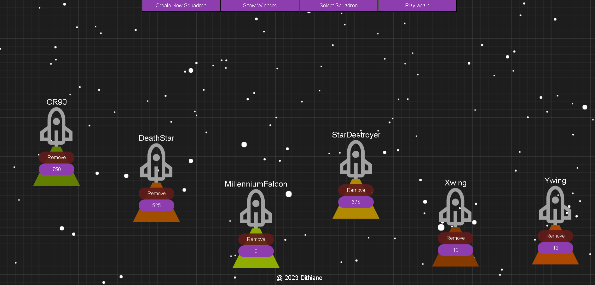

<h1>StarWar squadron's race game</h1>

Squadrons, players assume the role of a starfighter pilot. Players engage in a race in the space, can upgrade their speed, remove opponents, and be winner.

<h2>Technologies Used</h2>

<ul>
<li>HTML</li>
</ul><ul>
<li>CSS</li>
</ul><ul>
<li>JavaScript</li>
</ul><ul>
<li>React</li>
</ul><ul>
<li>Redux</li>
</ul><ul>
<li>Axios</li>
</ul><ul>
<li>Express</li>
</ul><ul>
<li>PostgreSQL</li>
</ul>

<h2>Features</h2>

<ul>
<li>Easy to use: Creating a new Squadron or Edit, is as simple just click a button and enter Namae, Speed, and Weight of the new ship.</li>
</ul><ul>
<li>Random color: Each Squadron has unique random generated color.</li>
</ul><ul>
<li>Use badge: User can be assigned randomly to the Squadrons represented on the field.</li>
</ul><ul>
<li>Statistic: Observe the statistics for all the winners just by clicking button.</li>
</ul>

<h2>Frontend</h2>

<ul>
<li>Interactive features like buttons, scroll, graphic elements</li>
</ul><ul>
<li>Communicates with server in a redux by dispatch for make requests, store app state for display data</li>
</ul><ul>
<li>Includes global, local, responsive styles</li>
</ul>

<h2>Server</h2>

<ul>
<li>Uses controller for communicate with the client. It handles the requests that come in, and chooses how the app is going to handle them</li>
</ul><ul>
<li> Uses Sequelize to seed, create, update tables</li>
</ul>

<h2>Setup</h2>

Clone the project:
git clone https://github.com/dithiane/swapi-squadron-race.git
<ul>
<li>1.Install the dependencies: npm i</li>
</ul><ul>
<li>2.Run the application: npm run dev</li>
</ul>

Check it out:
<ul>

</ul><ul>
<a href="https://drive.google.com/file/d/13psjeRpnoTyieRLi14y4iRBal-zb8PDo/view?usp=sharing">StarWars Squadron Game Video presentation</a>
</ul><ul>
<a href="http://18.204.19.56/">Game</a>
</ul>
